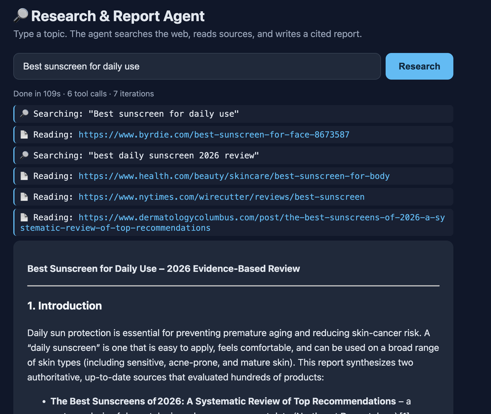

# Lab 02 — Research & Report Agent

A multi-step AI agent that researches a topic and writes a cited report. Type a topic, it searches the web, reads the best sources, and synthesizes the findings. Built on Groq function calling, served with FastAPI.

Live: https://taller-lab02.onrender.com

[](https://taller-lab02.onrender.com)

(Free tier sleeps when idle — first request may take ~30-60s to wake. Research itself also takes ~20-60s.)

## Tools

- `web_search` — finds relevant sources for a query (Tavily).
- `fetch_url` — fetches a page and returns its main text, HTML stripped (httpx + BeautifulSoup).
- `analyze_data` — distills long text down to the key points for a given focus (a sub-LLM call).

## Files

- `agent.py` — the agent loop: sends the topic to Gemini, runs tool calls, feeds results back until it writes the report.
- `tools.py` — the three tools as Gemini function declarations.
- `executors.py` — the actual tool implementations and the router.
- `main.py` — FastAPI app: `POST /research`, `GET /health`, and the chat UI at `/`.
- `static/index.html` — the chat-style frontend.
- `requirements.txt` — dependencies. `pyproject.toml` is for local dev with `uv`.

## Run locally

```bash
uv sync
uvicorn main:app --reload
```

Needs `GROQ_API_KEY` and `TAVILY_API_KEY` in a `.env` file.

## Deploy (Render)

- Containerized via `Dockerfile`; `render.yaml` configures the service.
- Set `GROQ_API_KEY` and `TAVILY_API_KEY` as secrets in the Render dashboard.
